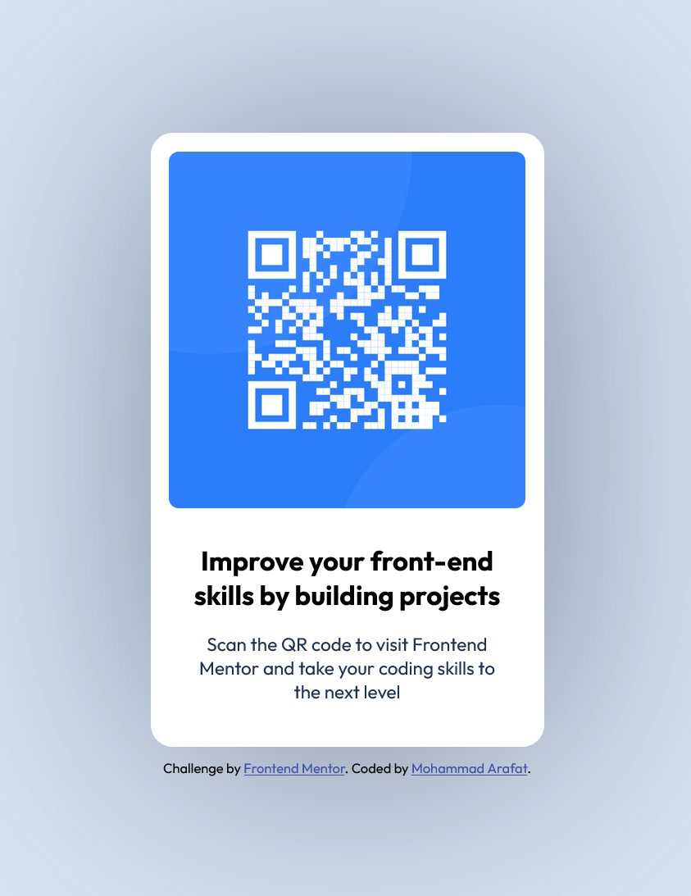
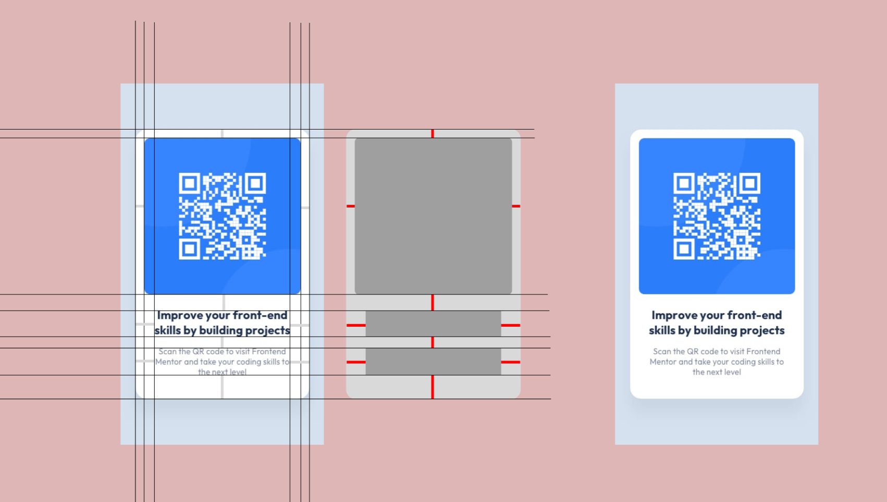

# Frontend Mentor QR Code Card Component Challenge Solution

This is a solution for the following challenge at ( https://www.frontendmentor.io/challenges/qr-code-component-iux_sIO_H ). Frontend Mentor challenges are a great way to improve your frontend skills and learn new ones while working on real-world projects.

# Table of Contents :

- [Overview of the project](#overview-of-the-project)
- [Screenshots of the project](#screenshots-of-the-project)
- [Links to the solutions](#links-to-the-solutions)
- [What I used to complete the project](#what-i-used-to-complete-the-project)
- [What I learned by finishing the project](#what-i-learned-by-finishing-the-project)
- [What I still need to work on](#what-i-still-need-to-work-on)
- [Useful resources in case anyone gets stuck](#useful-resources-in-case-anyone-gets-stuck)
- [About Me](#about-me)
- [A Few Words](#a-few-words)

---

## Overview of the project:

    The following is a challenge to create a static card component using HTML and CSS. The card component is a QR code which leads to frontendmentor.io as soon as you scan it. As the page is a single  static component, the project is really easy to complete (Well, for me, it was supposed to be...) and this project is a good starting point to start implementing what you learned in HTML and CSS or to refresh your basic skills.
---

## Screenshots of the project:
    Screenshot of the finished product from the challenge

---
---

    Screenshot of the process I used to figure out everything needed to tackle the project using Figma

---

## Links to the solutions: 
- Project Solution URL ------- [QR Code Challenge Project Solution](https://github.com/arafat765/frontendMentor.io_QR_Code_Challenge)
- Project Live Site URL ------- [QR Code Challenge Project Live Site](https://arafat765.github.io/frontendMentor.io_QR_Code_Challenge/)

---

## What I used to complete the project:
    - Semantic HTML for constructing the card component
    - Sass for styling the card component
    - Flexbox for positioning
    - Figma for layout, padding and more as shown in the screenshot
    - Responsive design by using Responsive Web Design Mode from Firefox (Only one screen size didn't work and I was not going to spend an eternity trying it. Guess which one it is.)

---

## What I learned by finishing the project:
    - Using proper HTML Structure
    - Using Sass to write stylesheets
    - How to use CSS Flexbox
    - Using Figma to get an idea about layouts, padding, margin etc.
    - Using Git to maintain and publish my work

---

## What I still need to work on:
    - Better use of semantic HTML
    - Better use of Sass to write stylesheets
    - Better use of flexbox
    - Better use of git

---

## Useful resources in case anyone gets stuck:
- [Flexbox by developer.mozilla.org](https://developer.mozilla.org/en-US/docs/Web/CSS/CSS_Flexible_Box_Layout/Basic_Concepts_of_Flexbox)
- [Sass guide by the Sass Team](https://sass-lang.com/guide)

---

## About Me:
- Frontend Mentor - [@arafat765](https://www.frontendmentor.io/profile/arafat765)

---

## A few words:
Salam.

Please be patient when doing these challenges. If you get stuck, keep on trying and also get help from other fellow members. For example, (This is a little bit embarassing...) I couldn't make flexbox work on my project just because I didn't include a height for my container. In the end, StackOverflow solved the problem. Like this, I have faced many more problems and eventually, I solved them all (I hope so...) which led to this. So, never give up. This placce is really awesome for boosting and learning skills. If you keep at it, you will feel proud of yourself for your work eventually.

Until next time....

Salam
